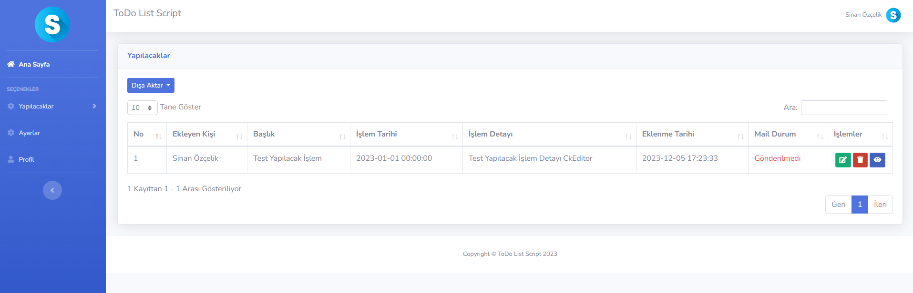

## PHP ToDo List Script

### Description

Small PHP web script to allow multiple developers on a project maintain a communal TODO list to help development.

Basic CRUD operations on task, create account, delete account, change password etc.

When the date of the transaction approaches, the website sends an e-mail to the user.

## Getting Started 

### Prerequisites

* For the project to work, the minimum PHP version must be 5.6.
* Mysql must be installed for the database.

### Installation

You can install manually, follow these steps:

1. Create a new mysql database named **todo**
2. Import **sql/todo.sql** located in the root directory.
3. Email address for first login: 
   * **Username:** sinanozcelik@yaani.com 
   * **Password:** 123
4. Your password is encrypted with MD5 and recorded in the database, so please change your password from your profile after logging in, not directly from the database.
5. To send automatic e-mail, first fill in the e-mail settings section in the settings section according to your needs.
6. After logging in with this account, you can change your e-mail and password in the profile section on the left menu.
s 
### Tools

## Script Attribute

- [x] Site Management Information Update
- [x] Add To-Do
- [x] Member Sign Up
- [x] Sweetalert Popup
- [x] Automatic Email Sending
- [x] Export Excel & PDF & CSV

##  Contact Information

You can reach out to me using the following contact details:

I'm always open to development and collaboration. Feel free to reach out to me!